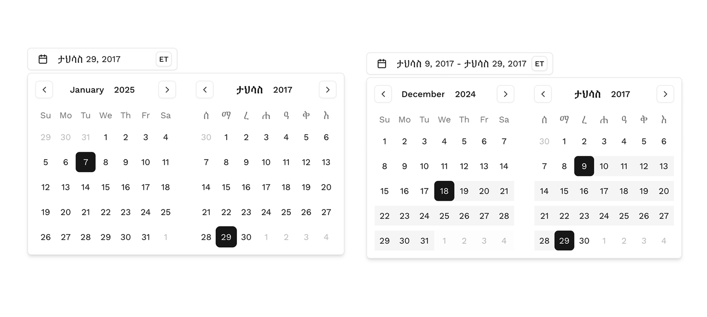

# Shadcn Ethiopian Date Picker

An Ethiopian calendar implementation for React applications, built on top of `react-day-picker` and styled with `shadcn/ui`. This package provides an integration of Ethiopian calendar functionality into your React applications.

## Screenshots

## Overview

The Ethiopian Date Picker offers a custom DateLib implementation that enables full Ethiopian calendar functionality while maintaining Gregorian calendar compatibility under the hood. It's designed to be flexible and customizable, allowing you to either use the pre-built components or create your own styled implementations.

### Key Features

- 🗓️ Dual calendar system - displays Ethiopian dates while storing Gregorian format internally
- 🔄 Comprehensive date conversion utilities
- 🎨 Fully customizable components
- 📅 Support for both single date and date range selection
- 🌐 Dual calendar view showing both Ethiopian and Gregorian dates
- ⚡ Support for all the features of `react-day-picker`

## Documentation

For detailed implementation steps, examples, and live demos, visit our [documentation site](https://shadcn-ethiopian-date-picker.vercel.app/).

The documentation includes:
- Step-by-step installation guide
- Component setup instructions
- Usage examples
- API reference
- Customization options

## Contributing

Contributions are welcome! Feel free to submit issues and enhancement requests.

## License

MIT

## Author

Temesgen Hailegiorgis

